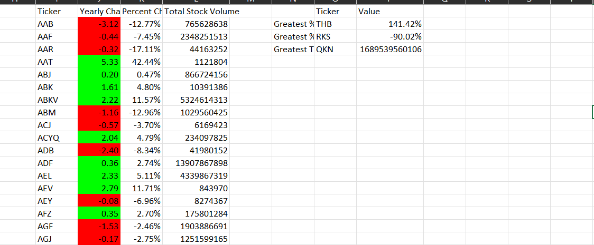
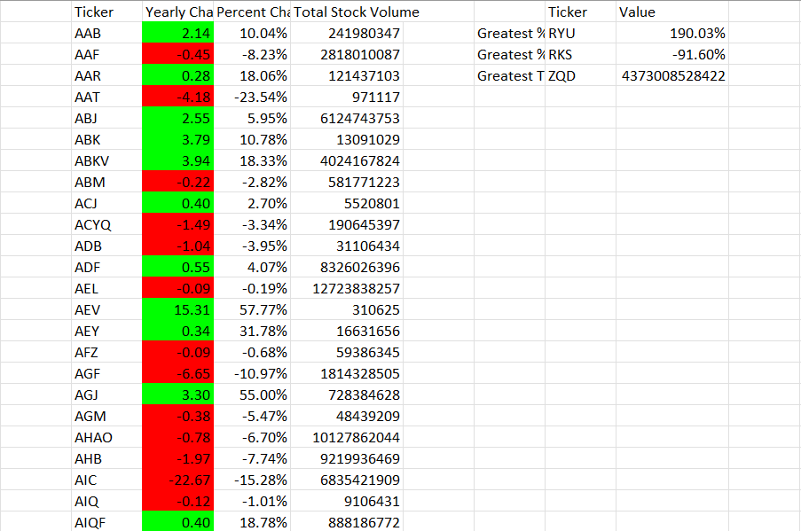
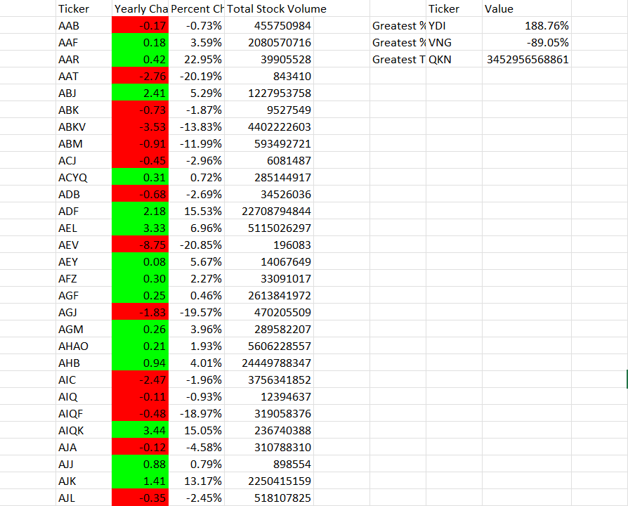

# How to Run:

- Open Multiple Year Stock Sheets

- Copy VBS script into module for specificed excel project

- Data must follow column format of ticker, data, open, high, low, close, volume in that order

- Sort data column on the data so that the start of the year is at the top

# Instructions

Create a script that loops through all the stocks for one year and outputs the following information:
    * The ticker symbol
    
    * Yearly change from the opening price at the beginning of a given year to the closing price at the end of that year.
    
    * The percentage change from the opening price at the beginning of a given year to the closing price at the end of that year.
    
    * The total stock volume of the stock. The result should match the following image:
    
    
    
    * Add functionality to your script to return the stock with the "Greatest % increase", "Greatest % decrease", and "Greatest total volume". The solution should match the following image:
    
    
    
* Make the appropriate adjustments to your VBA script to enable it to run on every worksheet (that is, every year) at once.

# Final Product

    - The script loops through one year of stock data and reads/ stores all of the following values from each row:

        - ticker symbol 

        - volume of stock 

        - open price

        - close price
    

    - On the same worksheet as the raw data, or on a new worksheet all columns were correctly created for:

        - ticker symbol

        - total stock volume

        - yearly change ($)

        - percent change

    - All three of the following values are calculated correctly and displayed in the output:

        - Greatest % Increase 

        - Greatest % Decrease 

        - Greatest Total Volume 

    2018 Sheet:
    

    2019 Sheet:
    

    2020 Sheet:
    

